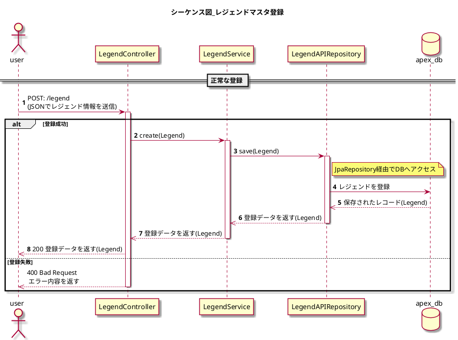

# シーケンス図

```plantuml
@startuml
skin rose

title シーケンス図_レジェンドマスタ登録

actor user
participant LegendController as LC
participant LegendService as LS
participant LegendAPIRepository as LR
database apex_db as DB

autoNumber

== 正常な登録 ==
user -> LC++ : POST: /legend\n(JSONでレジェンド情報を送信)

alt 登録成功
LC -> LS++ : create(Legend)

LS -> LR++ : save(Legend)

note right of LR : JpaRepository経由でDBへアクセス

LR -> DB : レジェンドを登録
LR <<-- DB : 保存されたレコード(Legend)

LS <<-- LR-- : 登録データを返す(Legend)

LC <<-- LS-- : 登録データを返す(Legend)

user <<-- LC : 200 登録データを返す(Legend) 
else 登録失敗
autoNumber stop
user <<-- LC-- : 400 Bad Request\n エラー内容を返す
end


@enduml
```