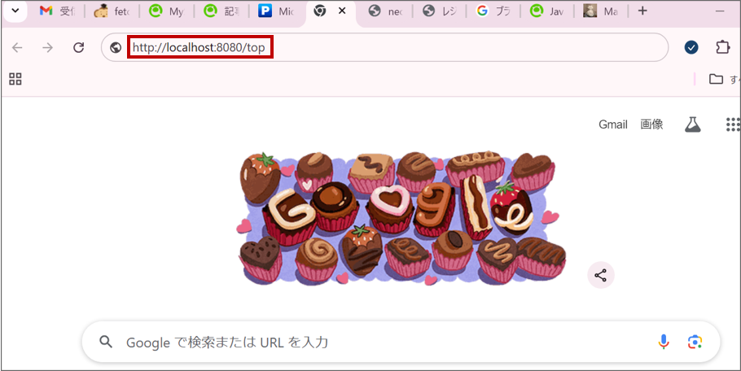
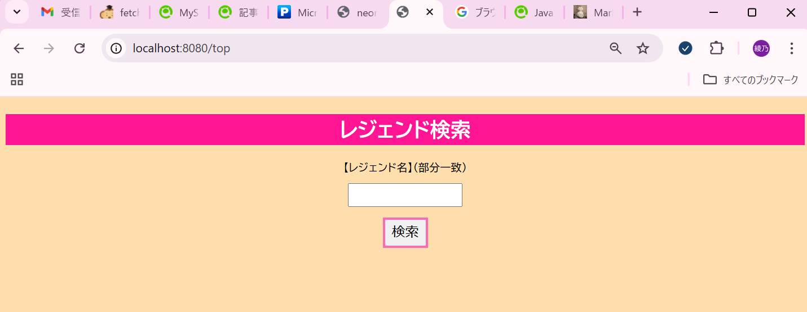

# ApexLegendsアプリケーション操作マニュアル

## 目次

- **はじめに**
- **目的**
- **操作方法**
　**1. トップページを開く**
　**2. 検索機能**
　　**2-1. 部分一致検索**
　　**2-2. 全件検索**
　**3. レジェンド一覧の見方**
　　**3-1. 詳細**
　**4. レビュー機能**
　　**4-1. 一覧**
　　**4-2. 編集**
　　**4-3. 削除**
　　**4-4. 登録**

## はじめに

- 対象者
  - ApexLegendsに興味のある方
  - ApexLegendsを遊んでみてレビューをしていただける方
 &nbsp;
- 動作環境
  - OS：Windows、Mac
  - ブラウザ：Microsoft Edge、Google Chrome
  - 総合開発環境：Eclipse、Visual Studio Code、IntelliJ IDEA
  - フレームワーク：SpringBoot

## 目的

本書は、ApexLegendsアプリケーションの基本的な操作方法について説明します。

## 操作方法

**1.トップページを開く**(GoogleChromeの場合)

- ブラウザのアドレスバーに　[**http://localhost:8080/top**]　と入力し、検索します
&nbsp;
 { width="80%" }
&nbsp;
- レジェンド検索ができる画面になります
こちらでは`部分一致検索`または`全件検索`ができます。
&nbsp;
 { width="80%" }
&nbsp;
 詳細については、「2.検索機能」をご覧ください。
