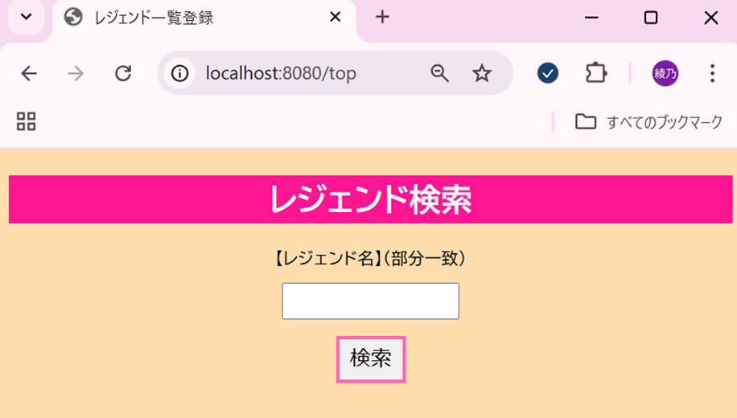
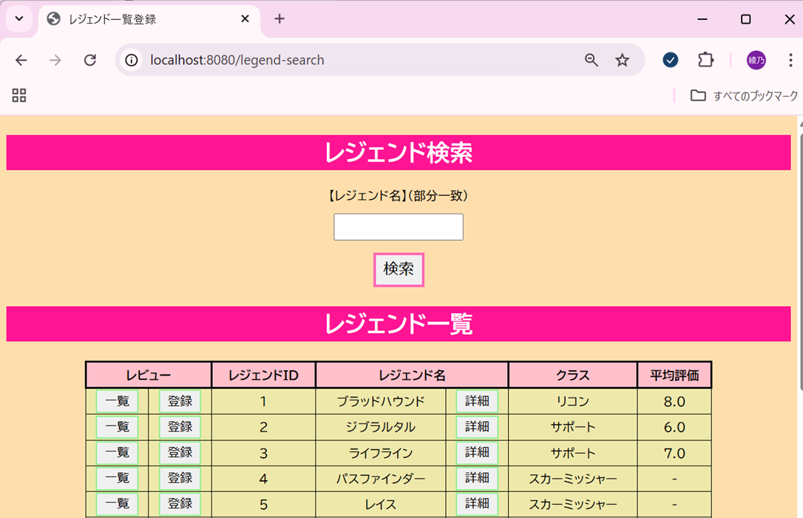
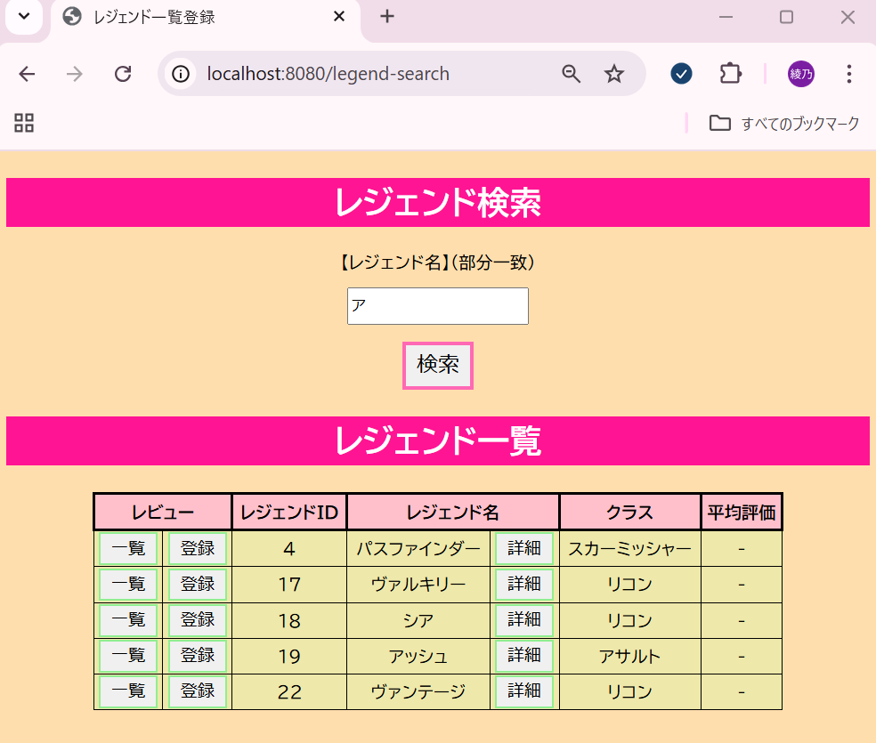

# ApexLegendsアプリのテスト仕様書

## Legend検索機能
### 検索画面
#### 正常系OK 検索画面表示
 - 検索バーにlocalhost:8080/topと入力

  * [x] エラーが表示されないこと
  * [x] 検索画面が表示されること  

### 全件検索
#### 正常系OK 全件検索
 - 検索画面のテキストボックスに何も入力しない状態で検索ボタンをクリック
  
  * [x] エラーが表示されないこと
  * [x] レジェンドがリストで全件表示されること  
 
  

### 部分一致検索
#### 正常系OK 部分一致検索
 - 検索画面のテキストボックスに「ア」と入力し、検索ボタンをクリック

  * [x] エラーが表示されないこと
  * [x] 名前に「ア」の入ったレジェンドがリストで表示されること  
 

  - 備考
    - 小さい「ア」の入ったレジェンドも表示される  

 - 検索画面のテキストボックスに「ハ」と入力し、検索ボタンをクリック  

  * [x] エラーが表示されないこと
  * [x] 名前に「ハ」の入ったレジェンドがリストで表示されること  
 

 -  備考
    - 濁音「バ」の入ったレジェンドも表示される
    - 半濁音「パ」の入ったレジェンドも表示される
